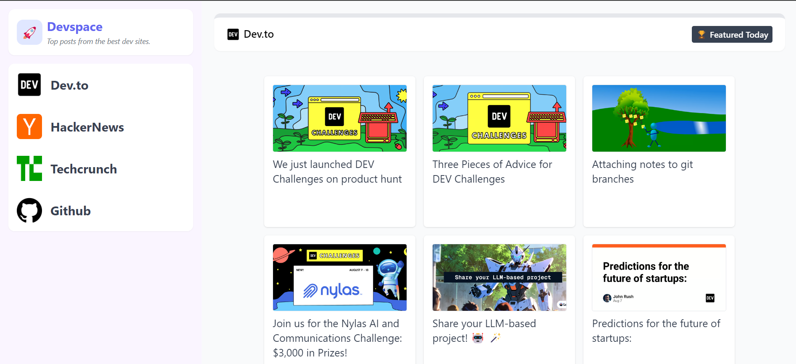

# Devespace

Devespace is a platform developed to help developers gain knowledge by aggregating top posts from various tech fields. Built using React.js and Tailwind CSS, this website provides a streamlined and user-friendly interface for discovering the latest and most relevant content in the tech world.



## Table of Contents

- [Features](#features)
- [Tech Stack](#tech-stack)
- [Installation](#installation)

## Features

- **Curated Content:** Aggregates top posts from multiple tech sources to ensure developers stay updated with the latest trends and insights.
- **Responsive Design:** Built with Tailwind CSS to provide a seamless experience across all devices.
- **Fast and Lightweight:** Leveraging the power of React.js for efficient rendering and interactivity.

## Tech Stack

- **Frontend:** React.js
- **Styling:** Tailwind CSS
- **API:** Integrates with third-party APIs such as Dev.to,TechCrunch, Github and others

## Installation

Follow these steps to get a local copy of the project up and running.

### Prerequisites

Make sure you have the following installed:

- Node.js
- npm (Node Package Manager)

### Clone the Repository

```bash
git clone https://github.com/ishitajain-30/DevSpace
cd frontend
npm install
npm start
```
